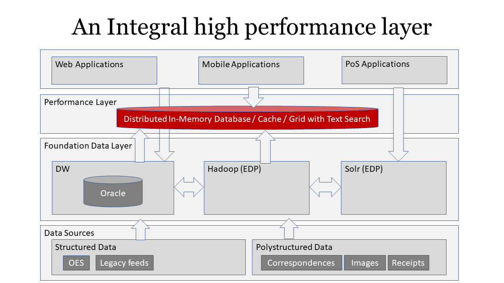

# Introduction

This repository describes the search for an ideal high-performance-search-analytics product which can sit between a traditional RDBMS or hadoop filesystem and application, and provide under 100ms query performance, search capability, large volumes, analytics, high availability etc.

# Proposed architecture
This picture depicts what architecture/capability we are after:

# Product feature comparisons
This table shows high level requirement for the product. With what we are after it's unlikely a single product can satisfy all requirements, so it's likely there will be trade-offs therefore we have widen the scope to include a variety of data technologies.

|Product|In-Memory|Disk |Sec Index |Columnar|Text Search|Scales|HA|CDCR| Lang.|Release|
|-------|---------|-----|----------|--------|-----------|------|--|----|------|-------|
|Solr   | ✖ cache | ✔  | ✔       |        | ✔✔✔ Lucene| Hor |✔  |✔  | Java | 2004 |    
|Elastic| ✖ cache| ✔   | ✔       |        | ✔✔✔ Lucene| Hor |✔  | ✔ | Java | 2004 |  
|Oracle(Text)| ✖ cache| ✔ | ✔    |        | ✔✔ Inverted| Ver| ✖ |✔  | C    |      |  
|PostgreSQL| ✖    | ✔ | ✔        |        | ✔         | Hor  | ✔ | ✔ | C   | 1996 |  
|MongoDB  | ✔ store|   | ✔        |        | ✔        | Hor  | ✔ |  ✔| C++  |2009  |
|Ignite(GG)| ✔ store | ✔ | ✔     |        | ✔✔ Lucene| Hor  | ✔ |✔  |Java  | 2007 | 
|EXASOL| ✔ store |       | ✔      |        | ✖        | Hor  | ✔ | ✔ |      |2000  |  
|VoltDB| ✔       |       |        |        | ✖        | Hor  | ✔ | ✔ |Java  |      |  
|Vertica|✖       | ✔    | ✔      |        | ✖        | Hor  | ✔ |✔  |      | 2005 |  
|MariaDB|✖       | ✔    | ✔      |        | ✖        | Hor  |✔  |✔  | C    | 2009 |  
|Cassandra|✖     | ✔    | ✖      |        | ✖        | Hor  |✔  | ✔ | Java | 2008 |  
|Sphinx| ✖ cache | ✔    | ✔      |        | ✔✔✔     | Hor  | ✔ | ✔ | C++  |2001  |  
|MemSQL|✔        | ✔    |        |  ✔     |           | Hor  | ✔ | ✔ | C++  | 2013 |

# Product evaluation
For the purpose of evaluation we have selected Solr, Elasticsearch, Oracle (Text) and Apache Ignite.

## Solr
 [Install SolrCloud](solr/install-solr-cloud/README.md)
 
 [Index Oracle DB on Solr](index-oracle-db/README.md)
 
 [Solr security](solr/security/README.md)
 
 [Solr performance](solr/performance/README.md)
 
## Elasticsearch

## Oracle (Text)

## Apache Ignite

# Product recommendation

The products were tested on a single VM on GCP (4 vCPUs + 15GB RAM) with 27 million records. 

|Selection criteria|Solr|Elasticsearch|Oracle(Text)|Ignite|
|------------------|----|-------------|------------|------|
|infrastructure implications|new VMs + SSD|new VMs + SSD |existing DB |new VMs + SSD |
|security (functional authorisation) | | | | |
|security (data role)| | | | |
|functional fit across our repositories to index| | | | |
|performance benchmarks with volumes | | | | |
|performance benchmarks with complex operations| | | | |
|performance benchmarks with ETL|~5000/s, 30 stored + 19 indexed fields| | | |
|maintainability | | | | |
|supportability| | | | |
|product support| | | | |
|knowledge community| | | | |
|maturity | | | | |
|TCO| | | | |
|deployability in our environment| | | | |
|source support-RDBMS| | | | |
|source support-OID,LDAP| | | | |
|source support-logs| | | | |
|source support-CMS e.g. WCC| | | | |
|source support-files| | | | |
|source support-JMS| | | | |
